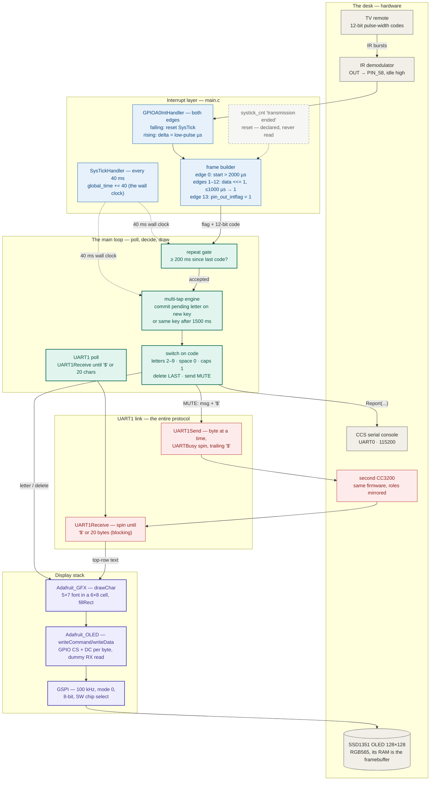
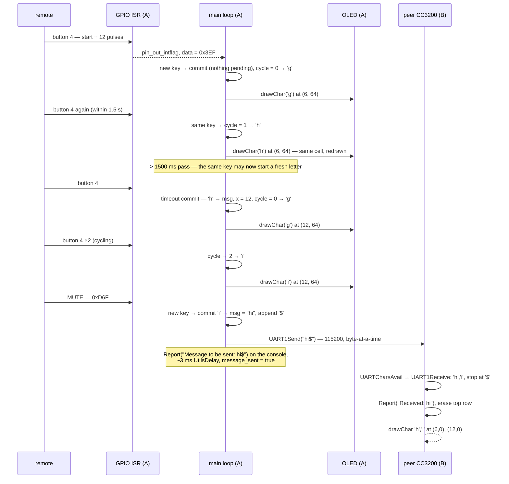

# IR Signal Decoder — system design

> How a thumb on a TV remote becomes a character on someone else's screen.
>
> An IR demodulator pulls **PIN_58** low for every burst of remote light; a
> both-edge GPIO interrupt times each low pulse against a free-running
> **SysTick stopwatch** and shifts twelve pulse-widths into a **12-bit button
> code**. The main loop turns codes into text with a **multi-tap engine**
> whose pending letter is drawn immediately but committed only by the *next*
> keypress, paints it live on a **128×128 SSD1351 OLED** one 6×8 glyph at a
> time, and — on MUTE — streams the finished message over **UART1** as plain
> bytes ending in `'$'`, to a second CC3200 running the very same binary,
> which draws it along the top of its own screen.

This document is the developer-facing map of the whole system — every
component and how data moves between them. The companion
[README](README.md) covers the wiring, per-layer detail, building, and
flashing; the pinout lives in
[docs/wiring-diagram.svg](docs/wiring-diagram.svg).

---

## End-to-end flowchart



**Legend** — ⬜ hardware / world · 🟦 interrupt layer · 🟩 main loop ·
🟪 display stack · 🟥 UART1 link & peer board ·
◌ dashed = present but unwired (the decoder's timeout reset).

---

## How to read it: the three ideas that matter

1. **One timer is both stopwatch and wall clock.** SysTick is loaded with
   3,200,000 ticks — 40 ms at the CC3200's fixed 80 MHz — and serves two
   masters at once. The IR ISR uses it as a *stopwatch*: every falling edge
   writes `NVIC_ST_CURRENT` (any write clears the counter), and the rising
   edge reads back the elapsed ticks to get the low-pulse width in
   microseconds. The wrap handler uses it as a *wall clock*: `global_time +=
   40` per period, giving the main loop a millisecond-denominated,
   40 ms-resolution notion of "now" for the 200 ms repeat gate and the
   1500 ms multi-tap timeout. No second timer peripheral, no timestamps in
   the ISR beyond one integer — the trade is that every "how long ago"
   decision is quantized to 40 ms, which is invisible at human keypress
   speeds.

2. **The ISR captures bits; all meaning lives in the loop.** The interrupt
   handler is deliberately dumb: a shift register (`data`), an edge counter,
   and a flag. It doesn't know what `0x7EF` means, doesn't debounce, doesn't
   track buttons. Everything with semantics — repeat suppression, the
   multi-tap cycle, caps lock, the send path — happens in a polling
   `while(1)` loop reading one `volatile` flag. The handoff is a single int
   wide: if a second frame completed before the loop serviced the first, the
   code would simply be overwritten. The 200 ms gate makes that a
   non-problem in practice, and in exchange the ISR runs in microseconds and
   can never deadlock the UI.

3. **Commit-on-next-keypress makes multi-tap timerless.** The letter you're
   cycling through exists only in `curr_letter` and on the screen; `msg[]`
   grows when the *next* keypress proves the previous letter final — a
   different button, or the same one after 1500 ms (checked lazily, at the
   moment of the next press). Every terminal action is itself "a next
   keypress": MUTE commits the last letter before appending `'$'` and
   transmitting, LAST commits it and then deletes it. Three codes are
   excluded from triggering a commit (`prev_data` ∈ {caps `0xFEF`, send
   `0xD6F`, delete `0x22F`}), and caps carries a `curr_cycle--` to cancel
   the cycle increment its own press causes. The one seam in the pattern:
   delete forgets to reset the cycle, so the first tap after LAST starts one
   letter into the group (see sharp edges).

---

## Deep dive 1 — typing "hi" and sending it

The concrete end-to-end flow, exactly as the code executes it (board A
composes, board B receives):



Two things worth noticing:

- **The double-tap of "hi" is the worst case of the design.** 'h' and 'i'
  live on the same key, so the second letter *requires* the 1500 ms timeout
  to elapse — the one place the lazy-commit scheme costs the user real time.
  Any two letters on different keys commit instantly.
- **Board B is not "the receiver" — it's the same program.** Both boards run
  identical firmware with a composer on row 64 and a mailbox on row 0. The
  protocol needs no roles, IDs, or handshakes because the link is a
  crossover of two symmetric loops.

## Deep dive 2 — anatomy of an IR frame

```text
 IR pin (PIN_58) — demodulator output, idle high, low during each burst

 ──────┐          ┌───┐    ┌─┐    ┌───┐    ┌─┐
       │  start   │   │ b0 │ │ b1 │   │ b2 │ ...      13 falling edges
       └──────────┘   └────┘ └────┘   └────┘          per frame
        > 2000 µs      long   short    long
                       = 0    = 1      = 0

 falling edge : HWREG(NVIC_ST_CURRENT) = 1     — stopwatch to zero
 rising edge  : delta = TICKS_TO_US(3,200,000 − SysTickValueGet())
                edge 0      : delta ≤ 2000 µs → abort (not a start bit)
                edges 1–12  : data <<= 1;  delta ≤ 1000 µs → data |= 1
                edge 13     : pin_out_intflag = 1 — frame complete

 result: a 12-bit code, MSB first —  e.g. 0111 1110 1111 = 0x7EF = button 2
```

The twelve button codes were captured **by hand** — the comment block at the
top of [main.c](main.c) records the raw binary observed for each key
("Binary & HEX from manual decoding") — so the firmware is married to one
remote's code set. Ten button codes end in `0xEF`, LAST in `0x2F`, and
MUTE in `0x6F` — all twelve share only the trailing `0xF`. The `switch`
matches them exactly, and an unknown code matches no case but still passes
the commit gate: it appends the pending `curr_letter` to `msg[]`, advances
the cursor a cell, and redraws that stale letter in the new cell —
duplicating it on screen and in the outgoing message.

Failure mode worth knowing: the frame builder has no timeout. A transmission
cut off before 13 edges leaves `reading_data = true`, so the next frame's
oversized start pulse is shifted in as an ordinary `0` bit and the decoder
stays misaligned until edge counts happen to line up again. The scaffolded
`systick_cnt` reset ("if it is not 0, we know the transmission ended") was
meant to be this timeout — it is incremented every 40 ms and read by nothing.

---

## Component inventory

| Component | Layer | Provenance | Where |
|---|---|---|---|
| IR decode ISR (`GPIOA0IntHandler`), frame rules | Input | ✅ project-authored | [main.c](main.c) |
| SysTick stopwatch/wall-clock plumbing | Timing | lab scaffolding pattern, wired here | [main.c](main.c) |
| Multi-tap engine, button `switch`, main loop | App | ✅ project-authored | [main.c](main.c) |
| `InitUART1` / `UART1Send` / `UART1Receive` | Link | ✅ project-authored | [main.c](main.c) |
| `writeCommand` / `writeData` / `Adafruit_Init` (lab `TODO 1–3`) | Display | ✅ implemented here | [Adafruit_OLED.c](Adafruit_OLED.c) |
| GFX primitives, `drawChar`, 5×7 font | Display | Adafruit (C port) | [Adafruit_GFX.c](Adafruit_GFX.c), [glcdfont.h](glcdfont.h) |
| SSD1351 command set, geometry | Display | Adafruit | [Adafruit_SSD1351.h](Adafruit_SSD1351.h) |
| Console (`InitTerm`, `Report`, `Message`) | Debug | TI SDK | [uart_if.c](uart_if.c) |
| Pin routing (generated by TI PinMux 4.0.1543) | Board | TI-generated | [pin_mux_config.c](pin_mux_config.c) |
| Linker map — RAM image at `0x20004000` | Build | TI | [cc3200v1p32.cmd](cc3200v1p32.cmd) |
| `startup_ccs.c`, `uart_if.h`, `driverlib.a` | Build | TI SDK — referenced, **not in repo** | [.project](.project) links |
| Prebuilt image + debug config | Artifacts | build output, checked in | [Debug/](Debug/), [.launches/](.launches/) |
| `README.html` | — | ⬜ TI `uart_demo` leftover | [README.html](README.html) |

---

## The numbers that matter

| Value | What it is |
|---|---|
| 80 MHz | the CC3200's fixed clock (`SYSCLKFREQ`) |
| 3,200,000 ticks = 40 ms | SysTick reload — stopwatch range *and* wall-clock granularity |
| > 2000 µs | low pulse accepted as a start bit (edge 0) |
| ≤ 1000 µs | low pulse decoded as a `1` (edges 1–12) |
| 13 | edges per frame: 1 start + 12 data bits |
| 12 bits | button code width — `0x6EF` … `0xD6F`, hand-captured |
| 200 ms | repeat-suppression window between accepted codes |
| 1500 ms | same-key gap that commits the pending letter |
| 115200 8N1 | both UARTs — UART1 board link and UART0 console |
| `'$'` | the entire message-framing protocol |
| 20 | max characters `UART1Receive` will collect |
| 50 | `msg[]` capacity — appended to without a bounds check |
| 100 kHz | GSPI clock (mode 0, 8-bit, software active-high CS) |
| 128 × 128 | SSD1351 panel, RGB565 — 32,768 data bytes per full-screen fill |
| 6 × 8 px | glyph cell (5×7 font + spacing); row 0 = received, row 64 = composing |
| ~3 ms | `UtilsDelay(80000)` after each send |
| `0x20004000` | RAM image base — `0x13000` code region, `0x19000` data region |

---

## Verification status

There are no automated tests — plainly: no unit tests, no host build, no
simulator. The system was validated the way embedded labs are: flashed to
hardware and exercised interactively. The repo carries the evidence of that
loop rather than a harness for repeating it:

| Instrument | What it shows | Where |
|---|---|---|
| UART0 console | `Message to be sent: …` / `Received: …` lines narrate both directions of every exchange | `Report` calls in [main.c](main.c) |
| The OLED itself | live echo of composition (row 64) and reception (row 0) — the UI is its own oracle | [main.c](main.c) |
| Checked-in build | `Debug/lab3-pt4.bin` / `.out` / `.map` — the exact image that ran | [Debug/](Debug/) |
| Debug launch config | the CCS session used to load and run it | [.launches/](.launches/) |
| Hand-decode table | the raw binary observed per button, the ground truth the `switch` encodes | comment block in [main.c](main.c) |

The single git commit is titled *"Fully functioning IR Signal Decoder"* —
the repo is a snapshot of the working state, not a development history.

---

## Design trade-offs & sharp edges

- **Lazy commit over timer-driven commit** — no timeout callback, no timer
  ISR touching text state, and terminal keys (send/delete) double as commit
  triggers so nothing is lost. The costs: same-key letters ("hi") wait out
  the full 1500 ms, and the one missing reset — delete doesn't zero
  `curr_cycle` — makes the first tap after LAST start mid-cycle.
- **A single flag as the ISR→loop queue** — one `volatile unsigned char`
  and one `int` of payload. Zero synchronization cost, but a code that
  arrives while the loop is busy *overwrites* its predecessor — and the loop
  can be busy for a long time, because…
- **`'$'`-framing over packets** — the old README imagined typed packets
  with IDs and checksums; the real protocol is "bytes until a dollar sign,"
  which is exactly as much protocol as two identical boards on a crossover
  wire need. But `UART1Receive` spins until the frame ends: a peer dying
  mid-message freezes the UI permanently, and a 20-byte overflow strands the
  terminator in the FIFO to be misread as an empty next message.
- **Screen-as-state over buffers-as-state** — there is no framebuffer and no
  text shadow; delete works by drawing a space over the dead glyph, cycling
  redraws one cell. Cheap and tear-free at 100 kHz SPI — but `x` marches 6 px
  per character with no wrap, so composition past column 128 is invisible
  (while `msg[]`, boundlessly appended, keeps growing toward the adjacent
  buffer at character ~48).
- **Per-byte GPIO chip-select over transactions** — every OLED byte pays CS
  assert + `SPIDataPut` + dummy `SPIDataGet` + CS deassert, and also toggles
  the hardware CS on PIN_50 that is wired to nothing. Correct, simple,
  visibly slow on full-screen fills — and the reason the UI only ever paints
  9-pixel-tall rows.
- **RAM-resident image over flashed firmware** — the linker puts everything
  at `0x20004000`; a debug launch just runs it. Perfect for a lab bench,
  gone on power-cycle unless the `.bin` is flashed with UniFlash.
- **One remote's codes, hardwired** — 12-bit hand-captured constants in a
  `switch`. A different remote means re-capturing and editing source; there
  is no runtime learning mode (the old README's "auto-detect format" never
  existed).

---

## Provenance

A university embedded-systems lab project: the CCS project is named
**`lab3-pt4`**, the checked-in `Debug/` makefiles reference a workspace under
an **"EEC 172"** directory, and the project was cloned from the CC3200 SDK
1.5.0 **`uart_demo`** projectspec (per [.ccsproject](.ccsproject); the
leftover [README.html](README.html) is TI's original uart_demo page).
TI provided the SDK scaffolding, generated pin mux, console helpers, and
linker script; Adafruit (Limor Fried/Ladyada, BSD) provided the graphics
core, SSD1351 command set, and font, ported to C. The project-authored work
is [main.c](main.c) — the IR decode ISR, the SysTick timing, the multi-tap
engine, the UART1 link, the main loop, and the hand-captured button-code
table — plus the SPI driver bodies filled in at the lab's `TODO 1–3` markers
in [Adafruit_OLED.c](Adafruit_OLED.c). No teammates are credited in the
repo or its git history; the only other personal identifier is the Windows
username `dalmamun` in the checked-in `Debug/` build paths, whose
relationship to the committer is not recorded.
